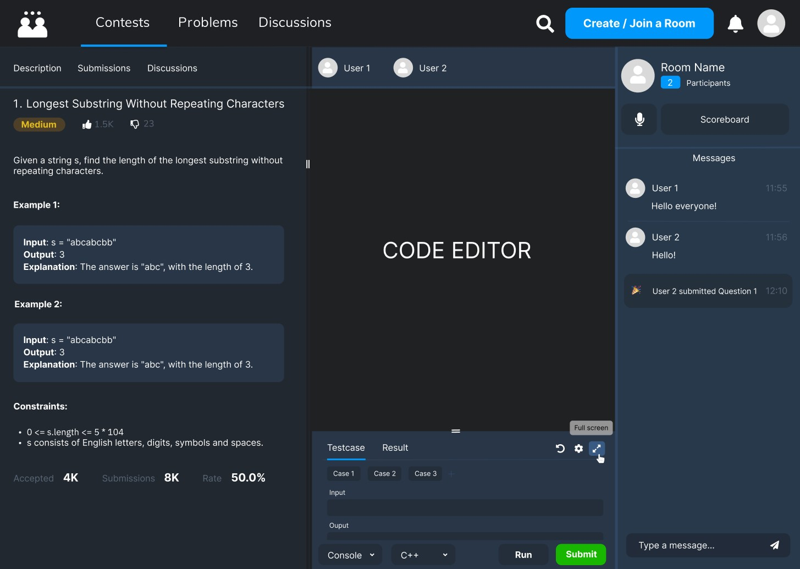

# CodeCord

A coding platform with enhanced collaboration and competition features. Create rooms to connect and solve problems together with other coders.

## Project Description

CodeCord is inspired by **binarysearch.com** (which has been shut down for some reason). It is a web application where users can **solve data structures & algorithm problems, give contests every week, maintain contest rating** and streak of solving problems daily similar to leetcode.
Apart from the usual leetcode features, it provides the feature to create a live room where you can invite your friends to code together. While creating a room, a user can **either create a contest** to solve specific set of problems within a time limit and compete with their friends **or create a normal room** with a shared editor where both users can code simultaneously.

#### Room features:

1. Three panes: problem description, code editor and console, room details and chat.
2. Users can join a voice call anytime(in case of contest, after end) and discuss.
3. In a contest, a live scoreboard to maintain user ranks depending on time taken and number of attempts.
4. Every user in the room can view each others code live by clicking user tabs on top of code editor(hidden until end in case of contest).

#### Potential future features:

- Ability to make **friends** with other users.
- **Interview rooms** with additional video calling feature.
